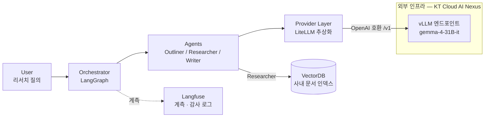
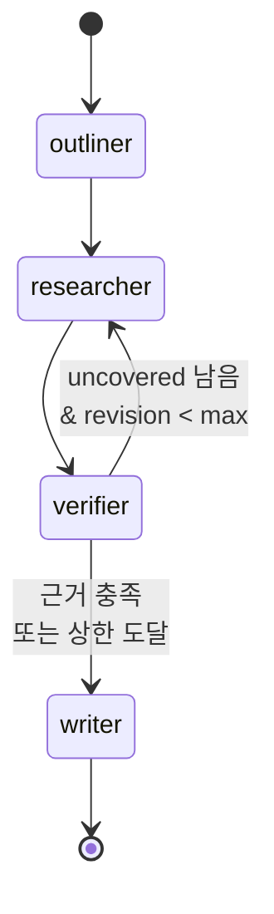

# Architecture — v1.1

> 상태: v1.1 개념도 (2026-09-15). 박스 단위의 논리 구성만 표현하며, 배포 토폴로지·스케일링은
> 이후 세션에서 별도 문서로 다룬다.
> v1.1에서 서빙 계층(원격 vLLM 엔드포인트)과 프로바이더 추상화를 도식에 반영했다 (ADR-003).

## 개념도

**경계.** 점선 안(`vLLM 엔드포인트`)만 우리가 운영하지 않는 영역이다. Provider Layer가
그 경계를 감싸므로, 엔드포인트가 바뀌어도 왼쪽 박스들은 영향을 받지 않는다.

## 구성 요소

| 박스 | 역할 |
| --- | --- |
| **User** | 리서치 질의를 입력하고, 생성된 초안을 검증·편집한다. |
| **Orchestrator** | 질의를 받아 에이전트 실행 순서와 상태를 관리한다. LangGraph의 State 그래프로 구현하며, 검증 루프(근거 누락 시 재검색)도 여기서 제어한다. |
| **Outliner / Researcher / Writer** | Outliner는 질의를 조사 항목으로 분해하고, Researcher는 항목별로 근거 문서를 검색·추출하며, Writer는 근거에 붙은 초안을 작성한다. 세 에이전트는 동일한 모델을 공유하고 프롬프트·툴 스코프로만 구분된다. |
| **Provider Layer** | 모든 모델 호출이 지나는 단일 통로 (`src/providers/`). LiteLLM으로 OpenAI 호환 엔드포인트를 호출하며, 엔드포인트 주소·모델 이름은 `.env`로 주입한다. 이 계층이 있어 엔드포인트 교체가 Orchestrator/Sub-agent 코드에 번지지 않는다 (ADR-003). |
| **vLLM 엔드포인트** | KT Cloud AI Nexus에 이미 배포된 vLLM 서버(`gemma-4-31B-it`). 우리가 기동·운영하지 않고 OpenAI 호환 API로 호출만 한다. 정부지원 GPU 자원 할당으로 무료이며 **2026년 말 만료** — 이후 대체 서빙 경로가 필요하다 (ADR-003). |
| **VectorDB** | 사내 문서의 임베딩 인덱스. Researcher만 접근하며, 검색 결과에는 출처 문서 ID와 위치가 항상 함께 반환된다. |
| **Langfuse** | 각 노드의 입출력·지연·토큰 사용량을 기록한다. 운영 가시성과 감사 로그 요구를 함께 충족한다. 외부 SaaS가 아니라 우리가 통제하는 인프라에 self-host 한다. |

## 설계 원칙

- **모델 고정, 하네스 분리.** 모델은 고정하고 오케스트레이션 구조·검증 루프·컨텍스트
  관리는 하네스 계층으로 분리한다. 성능 변화의 원인을 모델과 하네스로 구분해
  측정하기 위함이다 (ADR-002).
- **서빙은 교체 가능한 부품으로 둔다.** 현 엔드포인트는 2026년 말 만료가 예정돼 있다.
  모델 호출을 Provider Layer 뒤에 두어, 그 전환이 코드 변경이 아니라 설정 변경이 되게 한다.
- **근거 우선.** Writer는 Researcher가 반환한 근거 범위 밖의 주장을 생성하지 않는다.
  근거가 없으면 문장을 만들지 않고 누락으로 표시한다.
- **툴 스코프 최소화.** 각 에이전트는 자신에게 필요한 툴만 화이트리스트로 받는다
  (`.claude/rules/security.md`).

## 오케스트레이터 그래프 (session-02 골격)

`src/orchestrator/graph.py`의 실제 배선. 노드 내부 로직은 session-03에서 채운다.

`verifier → researcher`가 검증 루프다. 상한(`max_revisions`)에 도달하면 남은 항목을
"근거 없음"으로 표시한 채 `writer`로 넘어간다 — 무한 루프 대신 누락을 드러내는 쪽을 택한다.

## 다음 버전에서 다룰 것

- 문서 인제스천·인덱싱 파이프라인 (현재 도식은 질의 경로만 표현)
- 2026년 말 이후 대체 서빙 경로의 배포 토폴로지
