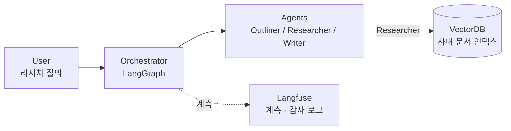

# Architecture — v1 (초안)

> 상태: v1 개념도 (2026-09-15). 박스 단위의 논리 구성만 표현하며, 배포 토폴로지·스케일링은
> 이후 세션에서 별도 문서로 다룬다.

## 개념도

## 구성 요소

| 박스 | 역할 |
| --- | --- |
| **User** | 리서치 질의를 입력하고, 생성된 초안을 검증·편집한다. |
| **Orchestrator** | 질의를 받아 에이전트 실행 순서와 상태를 관리한다. LangGraph의 State 그래프로 구현하며, 검증 루프(근거 누락 시 재검색)도 여기서 제어한다. |
| **Outliner / Researcher / Writer** | Outliner는 질의를 조사 항목으로 분해하고, Researcher는 항목별로 근거 문서를 검색·추출하며, Writer는 근거에 붙은 초안을 작성한다. 세 에이전트는 동일한 로컬 모델(vLLM 서빙)을 공유하고 프롬프트·툴 스코프로만 구분된다. |
| **VectorDB** | 사내 문서의 임베딩 인덱스. Researcher만 접근하며, 검색 결과에는 출처 문서 ID와 위치가 항상 함께 반환된다. |
| **Langfuse** | 각 노드의 입출력·지연·토큰 사용량을 기록한다. 운영 가시성과 감사 로그 요구를 함께 충족한다. 폐쇄망 안에 self-host 한다. |

## 설계 원칙

- **모델 고정, 하네스 분리.** 모델은 고정하고 오케스트레이션 구조·검증 루프·컨텍스트
  관리는 하네스 계층으로 분리한다. 성능 변화의 원인을 모델과 하네스로 구분해
  측정하기 위함이다 (ADR-002).
- **근거 우선.** Writer는 Researcher가 반환한 근거 범위 밖의 주장을 생성하지 않는다.
  근거가 없으면 문장을 만들지 않고 누락으로 표시한다.
- **툴 스코프 최소화.** 각 에이전트는 자신에게 필요한 툴만 화이트리스트로 받는다
  (`.claude/rules/security.md`).

## 다음 버전에서 다룰 것

- vLLM 서빙 계층을 별도 박스로 분리 (모델 서버 ↔ 에이전트 경계 명시)
- 문서 인제스천·인덱싱 파이프라인 (현재 도식은 질의 경로만 표현)
- 검증 루프의 상태 전이 다이어그램
